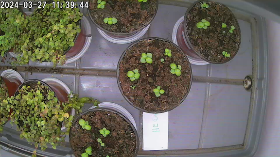
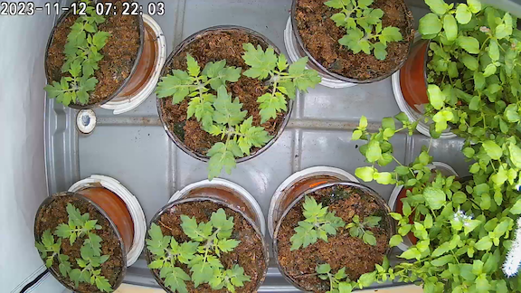
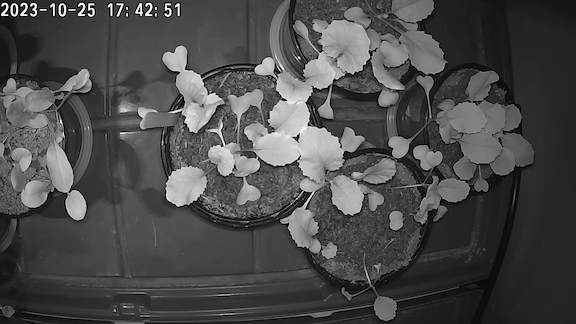
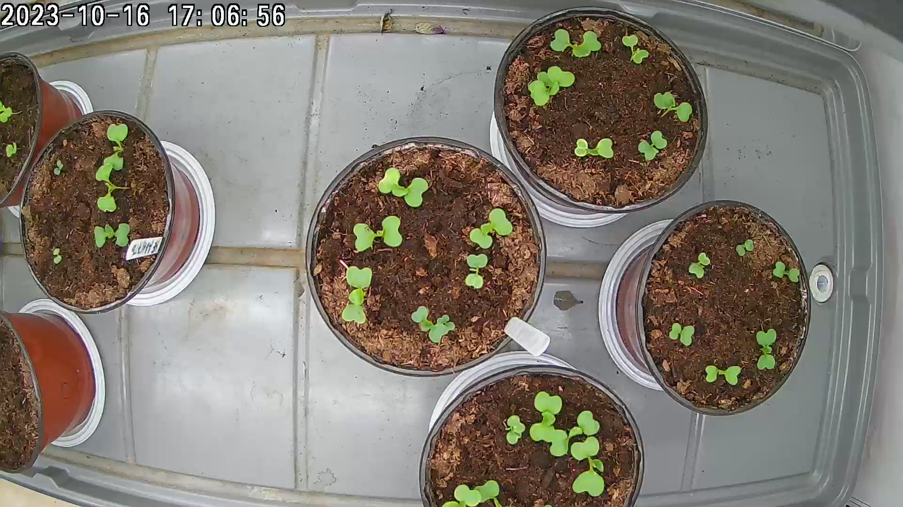
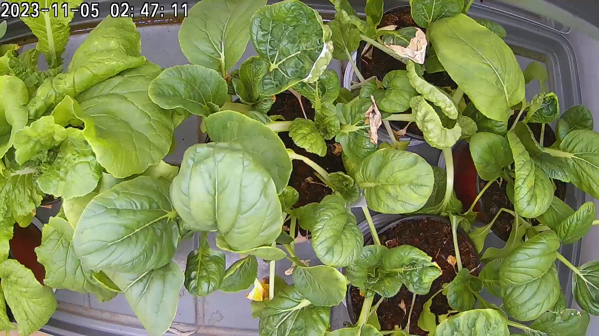
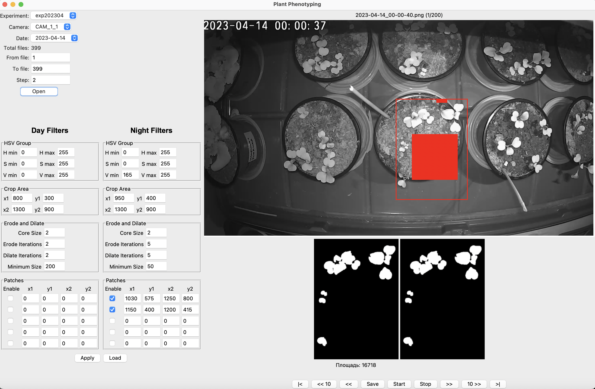
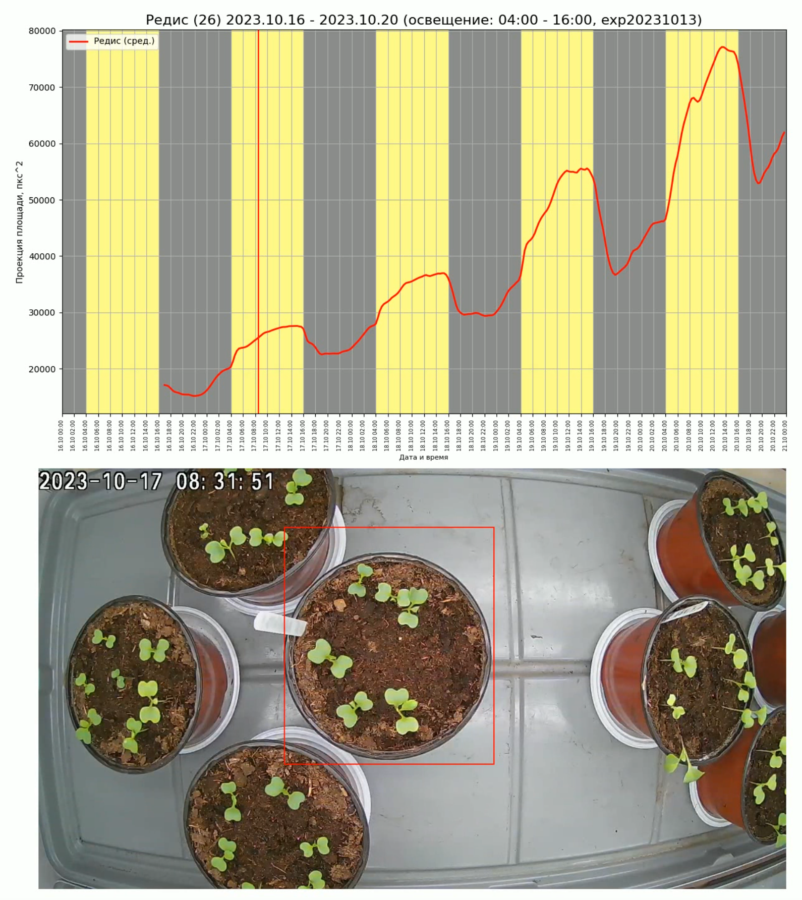

# Тема проекта

**"Применение методов компьютерного зрения для цифрового фенотипирования растений на основе RGB изображений"**
# Обоснование 

> [!NOTE] Фенотип = Генотип + Среда
> Фенотип - совокупность внешних и внутренних морфологических и функциональных признаков объекта, сформированных в результате взаимодействия генотипа и окружающей среды.

Фенотипирование - сбор метрик, по которым можно оценить влияние внешних и внутренних факторов.

**Применение:**
- Ускоренная селекция (speed breeding)
- Оптимизация агротехнологий (удобрения, освещение, и т.д.)
- Изучение генетических механизмов
- Исследования

# Стартовые условия 

### Общее описание 

Экспериментальная площадка на базе РСХА им. Тимирязева.

В ней несколько климатических камер (гроубоксов), в которых контролируется освещение и полив.

В гроубоксах над растениями закреплены IP камеры, с них по RTSP протоколу собираются изображения 1920x1080 с какой-то частотой.

Обычно измерения проводятся от момента прорастания, 2-3 недели - когда из-за плоности уже сложно различать растения между собой даже глазами.

**Количество изображений**

Частота съемки: каждые 3 минуты

Продолжительсноть съемки: 2 недели

Количество вариантов в каждом эксперименте: 4
**Итого**: ~ 20000 изображений на одну культуру в одном эксперименте.

### Примеры изображений

Базилик, день

Томат Микротом, день

Редис, ночь

Бок-чой, начало наблюдений

Бок-чой, конец наблюдений

### Обработка

Изображения собираются для оценки скорости прорастания, скорости роста и динамики внутридневных колебаний органов растения (*настические движения*).

Все эти признаки оцениваются по **площади проекции листьев на плоскость изображения**. То есть по площади маски сегментации.

Разметка ведется вручную с помощью HSV-фильтров на интересующей области. При этом маска строится по всем растениям, без разделения на особи.

*Обрабатывается **только центральный горшок**, он специально помечается, чтобы в течении эксперимента его не передвигали и не поворачивали, и вообще не трогали.*

Интерфейс для сегментации. Есть две группы фильтров, для ночных снимком (фильтрация по яркости), и для дневных (фильтрация по цвету). Если попадается что-то лишнее (отсвечивают края горшка например), применяются патчи (красный квадрат на изображении).

Площади полученных масок заносятся в базу данных, по результатам строятся графики.

Пример результатов обработки

# Цели

### Общие

1. Знакомство и практика применения современных подходов обработки изображений нейросетями.
2. Автоматизация и детализация процесса сегментации данных. 

### Конкретные

1. ✅ [Обучение нейросети для семантической сегментации всех растений в кадре на основе уже имеющейся разметки](1%20-%20Semantic%20Segmentation.md)
2. ✅ [Разметка части датасета и обучение нейросети для Instance Segmentation отдельных растений](2%20-%20Instance%20Segmentation.md)
3. [Трекинг растений (так как просто instance делает разные id-шники им, надо соотносить конкретные растения между кадрами на всем цикле)](3%20-%20Tracking.md)
   - [ ] Обработать остальные варианты, сделать таймлапсы с графиками площади по каждому растению
4. Part Segmentation частей растений (отдельные листья, стебли)
   - [ ] Разметка
   - [ ] Архитектура
   - [ ] Обучение
5. Сегментация перекрывающихся растений (Instance Segmentation with Occlusions/Layered Instance Segmentation)
6. Восстановление скрытых частей растений (Предсказание скрытых частей растений на основании видимых частей и предыдущих данных)