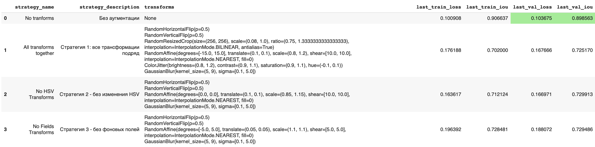

# Semantic Segmentation

### План 
1. [Выбор данных для обучения](#1-выбор-данных-для-обучения)
2. [Выбор архитектуры и аугментаций](#2-выбор-архитектуры-и-аугментаций)
3. [Обучение и результаты](#3-обучение-и-результаты)
4. [Визуальная оценка на новых данных](#4-визуальная-оценка-на-новых-данных)

### 1. Выбор данных для обучения

Всего для обучения есть разметка для следующих данных:

|Plant Culture|Night|Day|Total|
| ---------------- | ----- | ---- | ----- |
| Arugula Rococo   | 1998  | 2741 | 4739  |
| Arugula Victoria | 2253  | 3049 | 5302  |
| Some Salad       | 2830  | 3934 | 6764  |
| Some Tomato      | 2829  | 3934 | 6763  |
| Tomato Microtome | 2840  | 3776 | 6616  |
|Total|||30232|

Попробуем сделать универсальную нейросеть, которая может сегментировать все культуры на дневных и ночных изображениях.

Размер обучающей выборки будет 2000 изображениям, с равномерным распределениям по культурам (Руккола, Салат, Томат) и по ночным/дневным снимкам.

### 2. Выбор архитектуры и аугментаций

- **Архитектура сети**: Unet.

- **Размер входных изображений**: 256x256

- **Encoder**: resnet34

> [!NOTE] Использование аугментаций
> Аугментация данных проводиться не будет, потому что в дз по аугментациям исследование показало, что в данном датасете они только мешают, что связано со спецификой датасета: вид сверху (то есть флипы не нужны), день и ночь, разные культуры, в разных стадиях роста.
> [Cсылка на Colab](https://colab.research.google.com/drive/1F0qO9lGNvwWmUm9sMSGRuX6KIKFFlhEM?usp=sharing)

Лучшие результаты - без трансформаций

### 3. Обучение и результаты

Обучение в теч. 25 эпох дало следующие результаты:

IoU ~95%, весьма неплохо

### 4. Визуальная оценка на новых данных

На **таких же культурах** нейросеть дает отличный результат

Руккола

Томат

Очевидно, что нейросеть сохранила те же проблемы, что были в разметке. Например, плохо сегментируются тонкие стебли ночью.

На некоторых новых культурах сеть работает хорошо

Редис. Почему-то сегментируется белая метка

На некоторых предсказуемо не работает

Базилик Розе. На дневных снимках не определяется из-за своего цвета

