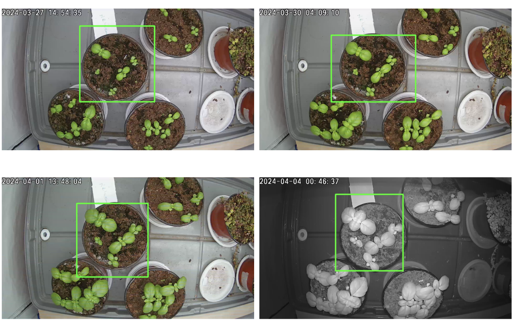
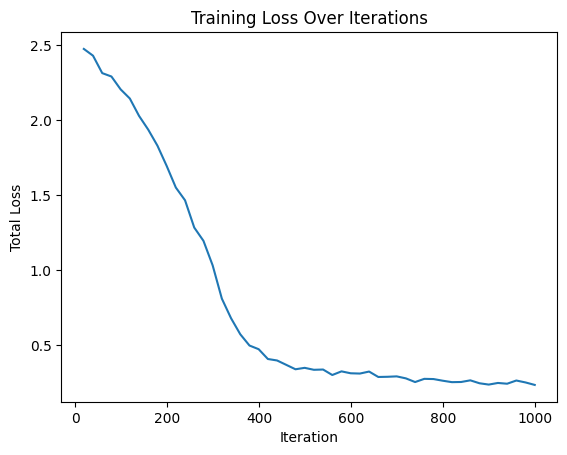
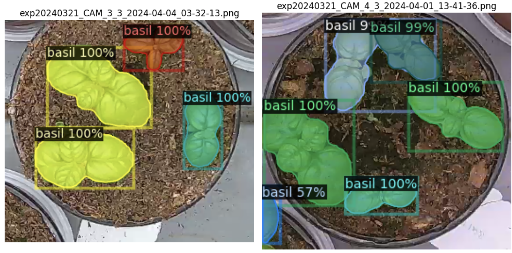
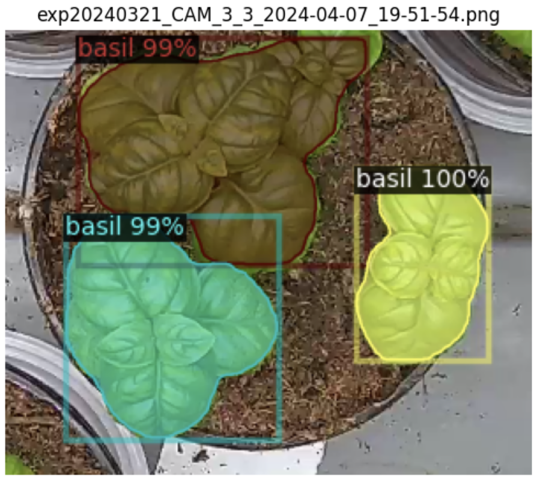

# Instance Segmentation

### План 
1. [Выбор данных для обучения](#1-выбор-данных-для-обучения)
2. [Выбор архитектуры](#2-выбор-архитектуры-и-аугментаций)
3. [Обучение и результаты](#3-обучение-и-результаты)
4. [Визуальная оценка на новых данных](#4-визуальная-оценка-на-новых-данных)

### 1. Выбор данных для обучения

Для обучения первой нейросети Instance Segmentation было решено выбрать изображения с базиликом, из-за простоты разметки. Всего было размечено 70 изображений, 50 для тренировки и по 10 для валидации и теста.
Изображения брались равномерно по стадиям проста, от ростков до момента, когда листья соседних растений начали перекрывать друг друга.

Был выбран эксперимент, в нем 4 варианта. Для тренировки будет использоваться 1 вариант. Растения во всех вариантах похожи, но так как я обрабатываю не все изображение, а только выбранную вручную область с центральным горшком, то для каждого варианты эта область отличается.

Поэтому при crop-е изображений для формирования датасета использовались не фиксированные выбранные координаты, а к ним рандомно добавлялись (-50, 50) пикселей

<i>Координаты Crop-а отличаются, для генерализации сети на разные размеры (до приведения к входным размерам, понятно)</i>

### 2. Выбор архитектуры
**Mask R-CNN** с архитектурой **ResNet-50** и **FPN**, обученной для задачи сегментации объектов на изображениях из набора данных **COCO**.

Библиотека detectron2.

### 3. Обучение и результаты
Из примера забыл поменять количество эпох, в результате сеть тренировалась 1000.

<i>Хотя по результатам достаточно было не намного меньше - около 600</i>

Полученные метрики:

|   AP   |  AP50  |  AP75  |  APs   |  APm   |  APl   |
|:------:|:------:|:------:|:------:|:------:|:------:|
| 83.909 | 99.325 | 94.370 | 69.857 | 87.061 | 84.709 |

### 4. Визуальная оценка на новых данных

Без окклюзий (или с небольшими) - работает хорошо

Когда окклюзии больше - уже хуже

