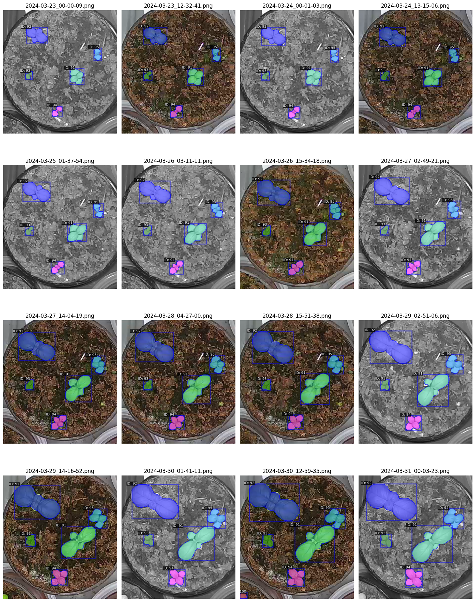

# Instance Segmentation

### План 
1. [Выбор метода трекинга и стратегия применения](#1-выбор-метода-трекинга-и-стратегия-применения)
2. [Результаты](#2-результаты)

### TODO
- [ ] Обработать остальные варианты, сделать таймлапсы с графиками площади по каждому растению

### 1. Выбор метода трекинга и стратегия применения

Трекер выбран обычный SORT, так как объекты не сильно перемещаются и изменяются между кадрами.

При предсказании новых данных моделью для Instance Segmentation, результаты для каждого кадра передаеются в трекер (библиотека sort).

Так как возвращаются из трекера они в другому порядке почему-то (не вникал почему), производится их сопоставление с изначальными по совпадению bounding boxes.

Данные с новым track-id сохраняются в формате COCO разметки.

### 2. Результаты

Одни и те же растения имеют один и тот же ID и отмечены одним и тем же цветом

