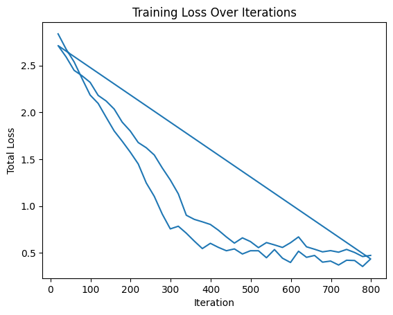

# Part Segmentation

### План 
1. [Выбор данных для обучения](#1-выбор-данных-для-обучения)
2. [Выбор архитектуры](#2-выбор-архитектуры-и-аугментаций)
3. [Обучение и результаты](#3-обучение-и-результаты)
4. [Визуальная оценка на новых данных](#4-визуальная-оценка-на-новых-данных)

### 1. Выбор данных для обучения

Для обучения были выбраны предсказанные предыдущей моделью данные, равномерно распределенные по времени и между 4 камерами.
Всего было размечено (достаточно криво) 216 объектов, 
распределение train/val/test = 80/10/10

### 2. Выбор архитектуры

Архитектура такая же как и в Instance Segmentation

### 3. Обучени и результаты

Тренировка длилась 800 эпох.

Из примера забыл поменять количество эпох, в результате сеть тренировалась 1000.

<i>ХЗ что за третья линия</i>

Полученные метрики:

|   AP   |  AP50  |  AP75  |  APs   |  APm   |  APl   |
|:------:|:------:|:------:|:------:|:------:|:------:|
| 74.885 | 93.014 | 88.538 | 56.336 | 87.650 | 90.000 |

| category   | AP     | category   | AP     |
|:-----------|:-------|:-----------|:-------|
| leaf       | 74.170 | cotyledon  | 75.600 |

#### 4. Визуальная оценка на новых данных

<i>Выглядит неплохо, учитывая качество разметки и перекос в сторону совсем маленьких растений. Надо попробовать предсказать по всему эксперименту и посмотроить timelapse, чтобы оценить получше и сделать вывод, можно ли какие-то данных отсюда вытащить (скорость появления новых пар листьев и так далее)</i>

#### UPDATE

1. Предсказывая новые данные, заметил что модель часто путает семядоли и листья.

Попробую это исправить с помощью трекера - он будет работать только на основе bb и area, и потом category будет такой, как у большинства из объектов с этим track_id

2. При визуализации трекинга нашел косяк - один и тот же лист сегментируется 2 раза

3. Простой SORT трекер теперь справляется не очень хорошо (когда предсказывает только по Area и Bbox) - видимо из-за неоднородности предсказаний, и изменения размера изображения входящего в модель

<i>Хорошо (больше 80% всего таймлапса) отмечены только 2 листа, остальные либо разбиты на 2 и более разных ID (например 7 + 8), много объектов вообще не попали в трекер (ID: -1)</i>

При попытке пересчитать треки с абсолютными значениеями bbox-ов, лучше не стало 

Учитывая, что мы знаем что количество предсказанных объектов не должно меняться на протяжении большинства времени, добавил алгоритм, который объединяет непересекающиеся треки, имеющие максимальное объединение

<i>Итог - красота</i>

### Выводы

Разметка - все! 